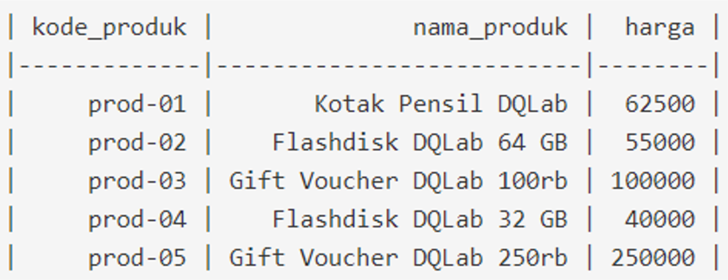
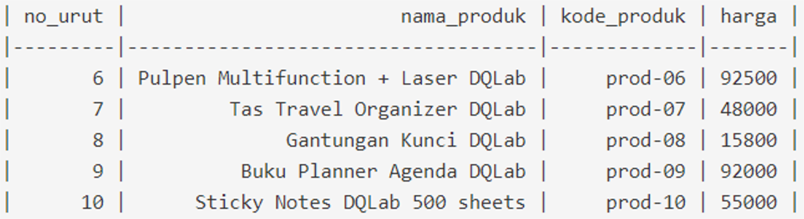

## Project UNION
Siapkan data katalog mengenai mengenai nama - nama produk yang dijual di suatu store. Data tersebut akan digunakan dalam meeting untuk mereview produk mana saja yang akan dilanjutkan penjualannya dan mana yang akan di diskontinu.

Siapkan hanya data produk dengan harga di bawah 100K untuk kode produk prod-1 sampai prod-5; dan dibawah 50K untuk kode produk prod-6 sampai prod-10.

Saat mengecek data produk di database, terdapat 2 tabel yang sama - sama berisi data katalog, yaitu :

### Tabel ms_produk_1


### Tabel ms_produk_2



### Jawaban:
```sh
SELECT nama_produk, kode_produk, harga FROM ms_produk_1
WHERE harga < 100000
UNION
SELECT nama_produk, kode_produk, harga FROM ms_produk_2
WHERE harga < 50000;
```


### output:
```sh
+----------------------------+-------------+-------+
| nama_produk                | kode_produk | harga |
+----------------------------+-------------+-------+
| Kotak Pensil DQLab         | prod-01     | 62500 |
| Flashdisk DQLab 64 GB      | prod-02     | 55000 |
| Flashdisk DQLab 32 GB      | prod-04     | 40000 |
| Tas Travel Organizer DQLab | prod-07     | 48000 |
| Gantungan Kunci DQLab      | prod-08     | 15800 |
+----------------------------+-------------+-------+
```
