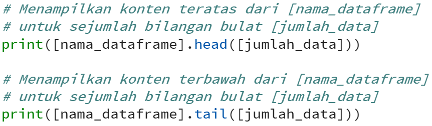
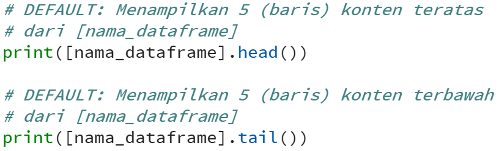

## Melihat preview data dari data frame

Selanjutnya, untuk mendapatkan gambaran dari konten dataframe tersebut. Kita dapat menggunakan function head dan tail, dengan syntax:

Jika [jumlah_data] pada function head dan tail dikosongkan maka secara default akan ditampilkan sebanyak 5 (lima) baris saja. Sehingga bisa ditulis sebagai berikut: 

