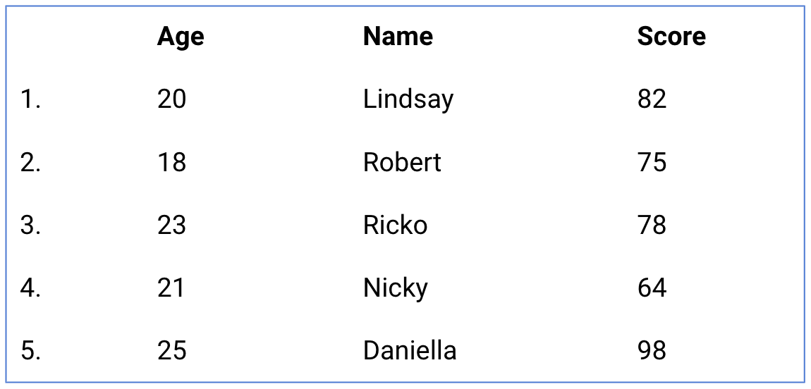
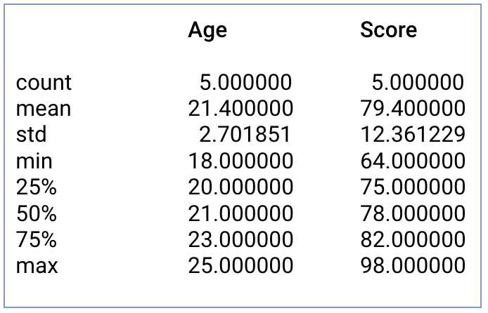

## Statistik Deskriptif dari Data Frame - Part 1

Statistik deskriptif atau summary dalam Python - Pandas, dapat diperoleh dengan menggunakan fungsi describe(), yaitu:


Function describe dapat memberikan informasi mengenai nilai rataan, standar deviasi dan IQR (interquartile range).

Ketentuan umum:
  - Secara umum function describe() akan secara otomatis mengabaikan kolom category dan hanya memberikan summary statistik untuk kolom berjenis numerik.
  - Kita perlu menambahkan argument bernama include = "all" untuk mendapatkan summary statistik atau statistik deskriptif dari kolom numerik dan karakter.
yaitu


### Contoh penggunaan describe() di Pandas!

Terdapat dataframe Pandas dengan nama nilai_skor_df dengan informasi seperti gambar dibawah:



dengan menggunakan fungsi describe pada nilai_skor_df

```sh
print(nilai_skor_df.describe())
```
menghasilkan



