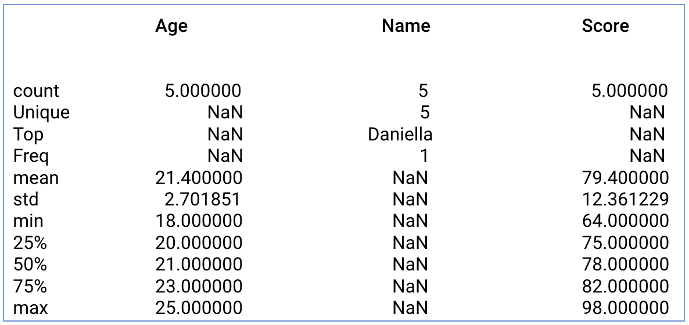

## Statistik Deskriptif dari Data Frame - Part 2

Jika ingin mendapatkan summary statistik dari kolom yang tidak bernilai angka, maka aku dapat menambahkan command include=["object"] pada syntax describe().

hasil:

Function describe() dengan include="all" akan memberikan summary statistik dari semua kolom. Contoh penggunaannya:

hasil:

