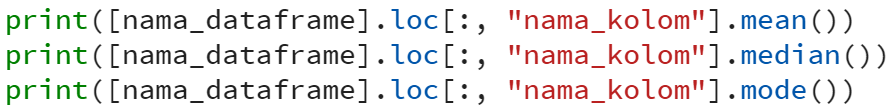
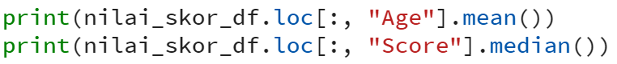

## Statistik Deskriptif dari Data Frame - Part 3

Selanjutnya, untuk mencari rataan dari suatu data dari dataframe. Aku dapat menggunakan syntax mean, median, dan mode dari Pandas.



contoh penggunaan:



hasil:

```sh
21.4 # Mean
78   # Median
```