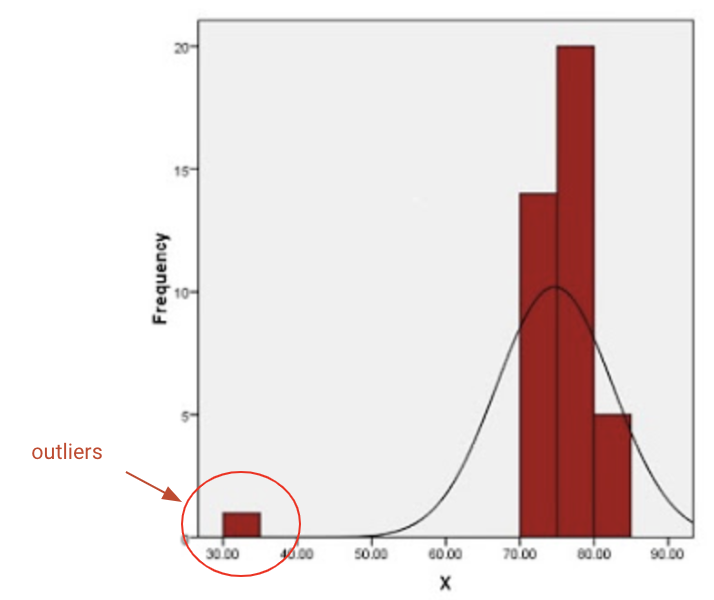

## Menemukan Outliers Menggunakan Pandas

Sebelum menuju ke step by step dalam menemukan outliers, sedikit intermezo dahulu mengenai definisi dari outliers.

Outliers merupakan data observasi yang muncul dengan nilai-nilai ekstrim. Yang dimaksud dengan nilai-nilai ekstrim dalam observasi adalah nilai yang jauh atau beda sama sekali dengan sebagian besar nilai lain dalam kelompoknya.



Pada umumnya, outliers dapat ditentukan dengan metric IQR (interquartile range).

Rumus dasar dari IQR: Q3 - Q1. Dan data suatu observasi dapat dikatakan outliers jika memenuhi kedua syarat dibawah ini:
  - data < Q1 - 1.5 * IQR
  - data > Q3 + 1.5 * IQR
 
Syntax di Python:
```sh
Q1 = nama_dataframe.quantile(0.25)
Q3 = nama_dataframe.quantile(0.75)
IQR = Q3 - Q1
print(IQR)
```

Contoh case: mengidentifikasi IQR dari dataframe nilai_skor_df
```sh
Q1 = nilai_skor_df[["Score"]].quantile(0.25)
Q3 = nilai_skor_df[["Score"]].quantile(0.75)
IQR = Q3 - Q1
print(IQR)
```

Hasil:
```sh
Age   : 3.0
Score : 7.0
dtype : float64 
```

Karena saat ini memiliki skor IQR, saatnya untuk menentukan Outliers. Kode di bawah ini akan memberikan output dengan beberapa nilai True atau False. Titik data di mana terdapat False yang berarti nilai-nilai ini valid sedangkan True menunjukkan adanya outliers.

```sh
print((nilai_skor_df < (Q1 - 1.5*IQR)) | (nilai_skor_df > (Q3 + 1.5*IQR)))
```

menghasilkan
```sh
      Age    Name   Score
0   False   False   False
1   False   False   False    
2   False   False   False
3   False   False   True
4   False   False   False
```