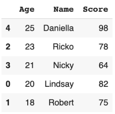

# Sorting Menggunakan Pandas
Sorting adalah sebuah metode mengurutkan data berdasarkan syarat kolom tertentu dan biasanya digunakan untuk melihat nilai maksimum dan minimum dari dataset.  
Library Pandas sendiri menyediakan fungsi sorting sebagai fundamental dari exploratory data analysis.

### Syntax default (ascending) operasi sorting pada Pandas:
```sh
nama_dataframe.sort_values(by="nama_kolom")
```

### Contoh:
Sorting terhadap dataset *nilai_skor_df* berdasarkan age!
```sh
nilai_skor_df.sort_values(by="Age")
```
#### Hasil:


Function tersebut akan secara default mengurutkan secara ascending (dimulai dari nilai terkecil).  
Untuk dapat mengurutkan secara descending (nilai terbesar lebih dahulu), dapat menggunakan properti tambahan:

### Syntax descending operasi sorting pada Pandas:
```sh
nama_dataframe.sort_values(by="nama_kolom", ascending=False)
```

### Contoh:
Sorting terhadap dataset *nilai_skor_df* berdasarkan age dimulai dari umur tertua!
```sh
nilai_skor_df.sort_values(by="Age", ascending=False)
```

#### Hasil:



## Fungsi sorting di Pandas juga dapat dilakukan menggunakan lebih dari satu kolom sebagai syarat. 

### Syntax sorting multi-column
  ```sh
  nama_dataframe.sort_values(by=["nama_kolom_1", "nama_kolom_2"], ascending=[False, True])
  ```

### Contoh: fungsi sorting menggunakan Age dan Score sekaligus
  ```sh
  nilai_skor_df.sort_values(by=["Age", "Score"], ascending=[False, True])
  ```


