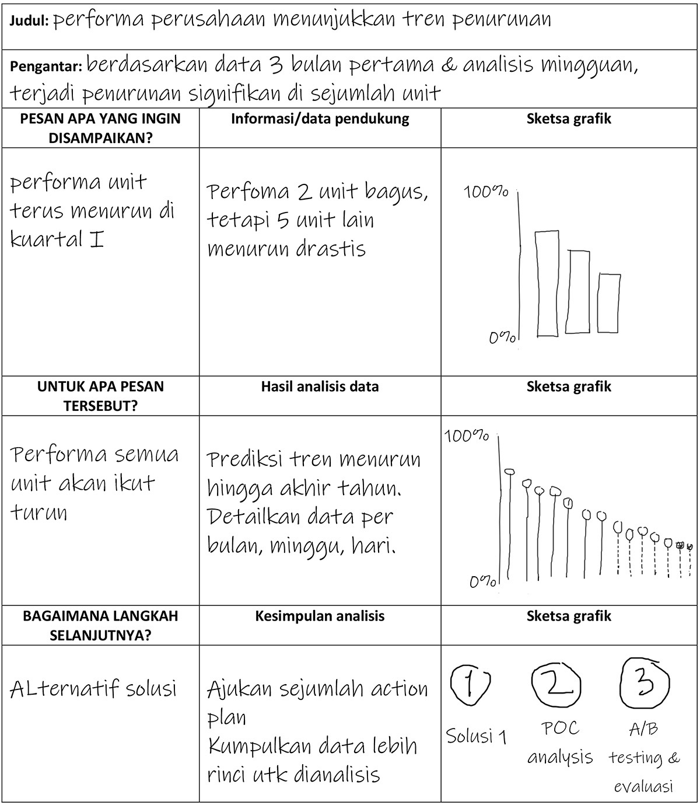

# Proses visualisasi data

  ## 1. pesan/hal apa yang paling ingin disampaikan kepada audiens

  ## 2. untuk apa orang lain perlu mengetahui hal yang disampaikan tadi
  
  
  ## 3. bagaimana caranya agar masalah yang disampaikan tadi bisa teratasi

------------------------------------------------------------------------------------------------------------------------------
### contoh proses visualisasi data:

