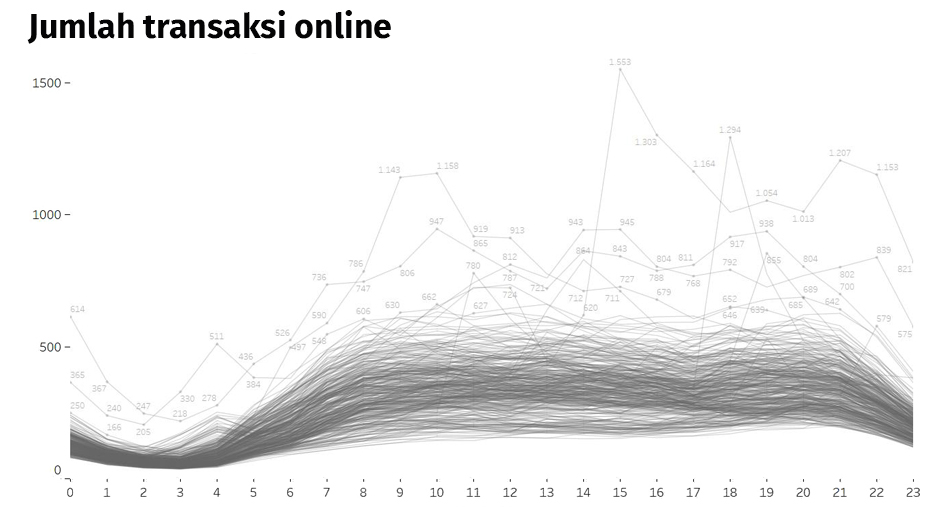
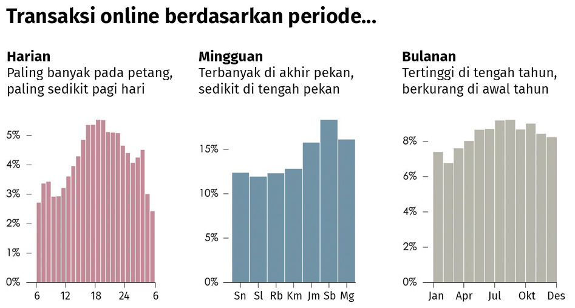
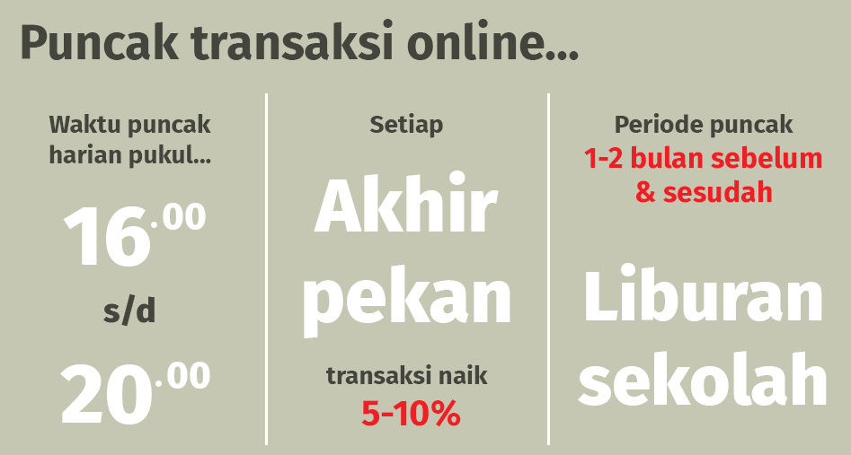

# Quiz 1

Dalam memaparkan data untuk rapat manajer tingkat menengah di perusahaan, terdapat sejumlah data yang harus ditampilkan kepada para manajer tersebut.

Tampilan grafik manakah yang paling tepat disajikan berikut in

### Visual 1

### Visual 2

### Visual 3

------------------------------------------------------------------------------------------------------------------------------

## Jawaban:

  - [X] Visual 2

  ### Penjelasan:

  Saat presentasi kepada manajer, data yang perlu dipaparkan adalah ringkasan atau kesimpulan dari sekumpulan data. Penyebutan  simpulan analisis data sangat perlu untuk menggiring manajer pada analisis tentang strategi/langkah lanjutan.

  Visual 1 akan menyulitkan audiens untuk mencari rata-rata ataupun puncak data. Bisa menyajikan gambar ini ketika berdiskusi dengan  para analis data. Analis akan mengeksplorasi data tersebut dengan analisis-analisis lanjutan yang lebih dalam.

  Adapun Visual 3 lebih cocok disajikan kepada audiens umum, misalnya untuk infografik atau materi presentasi kepada klien. Bisa juga   disampaikan untuk level direksi ke atas, dengan catatan penyaji siap dengan data yang lebih detail.