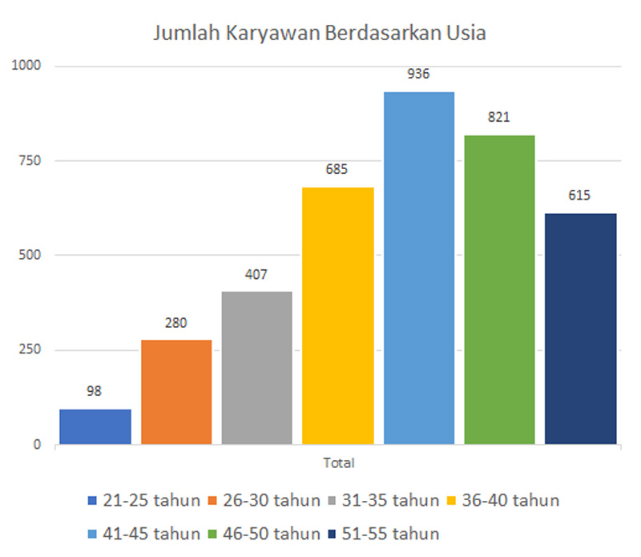

# Quiz 2

Di antara grafik-grafik ini, manakah yang paling cocok digunakan untuk menggambarkan jumlah karyawan berdasarkan usia?

### Pie Chart

### Column Chart

### Histogram

------------------------------------------------------------------------------------------------------------------------------

## Jawaban:

  - [X] Histogram

  ### Penjelasan:

  Kelompok usia adalah kategori data berantai yang saling  berhubungan. Secara psikis, pembaca data akan dapat   menghubungkan masing-masing kelompok usia itu berdasarkan  urutannya, misal dari usia paling muda (kecil) hingga paling    besar. Urutan ini tidak boleh diubah berdasarkan besaran nilai   data pada setiap kategori.

  Penggunaan pie chart dapat dimaklumi bila pesan yang ingin  disampaikan adalah proporsi jumlah karyawan berdasarkan usia.  Namun, tampilan pie chart di atas menyulitkan pembaca untuk  menelusuri bagian lingkaran dan keterangan kategori usia pada  legenda.
  
  Demikian juga dengan diagram kolom, penggunaan banyak warna   tidak mutlak digunakan, apalagi setiap kelompok tersebut  homogen, yakni dipilah berdasarkan rentang usia.
  
  Histogram horizontal memperlihatkan postur jumlah karyawan  berdasarkan usia. Dari tabel ini terlihat kelompok usia manakah  yang paling dominan.