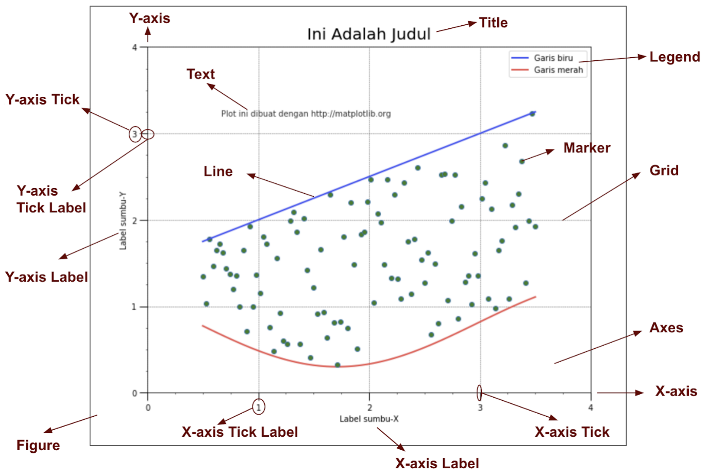

## Anatomi dari sebuah Figure di maplotlib:

Ada beberapa istilah dan komponen di sebuah plot, nanti akan mempermudah mengingat function apa yang digunakan untuk memodifikasinya.
  - **Figure** adalah keseluruhan visualisasi yang kita plot dalam 1 kali menjalankan code.
  - Sedangkan satu plot (yang dibuat saat memanggil .plot() atau .scatter()) disebut **Axes**. Sebuah Figure bisa terdiri dari beberapa Axes. Setiap Axes biasanya memiliki sumbu-X (**X-axis**) dan - sumbu-Y (**Y-axis**). Masing-masing sumbu memiliki komponen sebagai berikut:
    - **Axis Label**: Nama dari sumbu yang ditampilkan.
    - **Tick**: Penanda berupa titik/garis kecil yang berjajar di sumbu, sebagai referensi skala nilai.
    - **Tick Label**: Tulisan di tiap tick yang menyatakan nilainya.
  - Untuk isi grafiknya sendiri, bisa berupa **line** (untuk line plot), atau **marker** (untuk scatter plot), bisa juga bentuk lain seperti **bar** (untuk bar plot/histogram).
  - Aksesoris lain yang bisa ditambahkan, di antaranya **Grid** untuk mempermudah melihat tick yang sejajar, dan **Text** untuk memberikan informasi  tambahan berbentuk teks di grafik.

[figure anatomy link]

[figure anatomy link]: <https://matplotlib.org/3.1.3/gallery/showcase/anatomy.html>