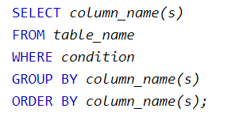

CASE WHEN Syntax

CASE - Statement ditempatkan sesudah SELECT, berikut syntax-nya secara lengkap :

SELECT ColumnName1, ColumnName2,  
CASE  
    WHEN condition1 THEN result1  
    WHEN condition2 THEN result2  
    WHEN conditionN THEN resultN  
    ELSE result  
END as alias  
FROM TableName;

CASE-statement akan mengevaluasi kondisi yang sudah ditentukan, dimulai dari condition1, dan akan mengembalikan hasil (result1), jika condition1 terpenuhi (TRUE). Jika tidak, maka condition2 akan dievaluasi, dan akan mengembalikan result2 jika condition2 terpenuhi, dst. Apabila tidak ada kondisi yang terpenuhi, maka result pada bagian ELSE yang akan dikembalikan. 