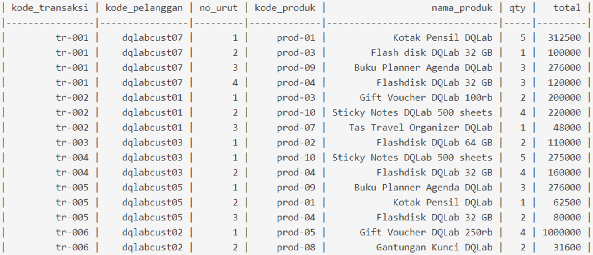

## Project INNER JOIN
Dalam database, terdapat tabel ms_pelanggan yang berisi data - data pelanggan yang membeli produk dan tabel tr_penjualan yang berisi data transaksi pembelian di suatu store.

Suatu hari, departemen marketing & promotion meminta bantuan untuk meng-query data-data pelanggan yang membeli produk Kotak Pensil DQLab, Flashdisk DQLab 32 GB, dan Sticky Notes DQLab 500 sheets.

Buatlah query menggunakan tabel ms_pelanggan dan tr_penjualan untuk mendapatkan data - data yang diminta oleh marketing yaitu kode_pelanggan, nama_customer, alamat.

NB: Gunakan SELECT DISTINCT untuk menghilangkan duplikasi, jika diperlukan.

### Tabel ms_pelanggan


### Tabel tr_penjualan



### Jawaban:
```sh
SELECT DISTINCT ms_pelanggan.kode_pelanggan, ms_pelanggan.nama_customer, ms_pelanggan.alamat
FROM ms_pelanggan
INNER JOIN tr_penjualan
ON ms_pelanggan.kode_pelanggan = tr_penjualan.kode_pelanggan
WHERE tr_penjualan.nama_produk = 'Kotak Pensil DQLab' OR tr_penjualan.nama_produk = 'Flashdisk DQLab 32 GB' OR tr_penjualan.nama_produk = 'Sticky Notes DQLab 500 sheets';
```


### output:
```sh
+----------------+--------------------+----------------------------------------+
| kode_pelanggan | nama_customer      | alamat                                 |
+----------------+--------------------+----------------------------------------+
| dqlabcust01    | Eva Novianti, S.H. | Vila Sempilan, No. 67 - Kota B         |
| dqlabcust03    | Unang Handoko      | Vila Sempilan, No. 1 - Kota B          |
| dqlabcust05    | Tommy Sinaga       | Vila Permata Intan Berkilau, Blok A1/2 |
| dqlabcust07    | Agus Cahyono       | Vila Gunung Seribu, Blok F4 - No. 8    |
+----------------+--------------------+----------------------------------------+
```
